# 관리하당

### 당뇨병 환자의 식단 관리를 도와주는 어플리케이션

## 기획 배경

#### 문제점

- 젊은 당뇨인구 급증 및 급속한 노령화로 인한 당뇨환자 증가
- 당뇨환자는 혈당 측정과 운동 및 식이조절, 수분 섭취 등의 관리가 필요하나 잘 이뤄지지 않는 경우 잦음

#### 해결방안

- 혈당 기록 및 관리, 식사 기록 및 관리 기능 제공
- 가족 혹은 케어를 도와주는 사람과 그룹을 맺도록 함
  - 그룹끼리는 지난 기록 보기, 챌린지 설정 등이 가능
  - 다른 멤버의 챌린지가 미완료라면 알림 전송 가능
- 식사 후 일정 시간이 지나면 혈당 기록 요구 알림 전송

## 개발 기간

#### 2023.10.09 - 2023.11.17 (7주)

  

## 🛠️ Tech Stack 🛠️

### Infra

### Front

### Back

  

## 아키텍처

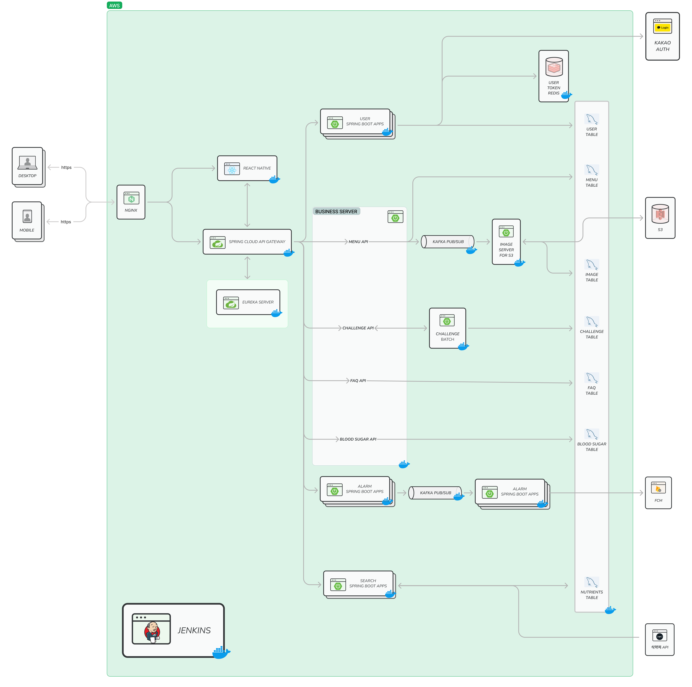

## ERD

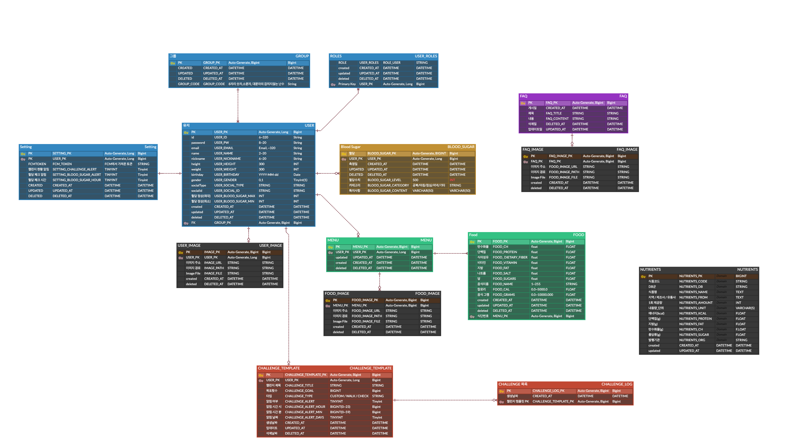

  

## 결과물

### 메인

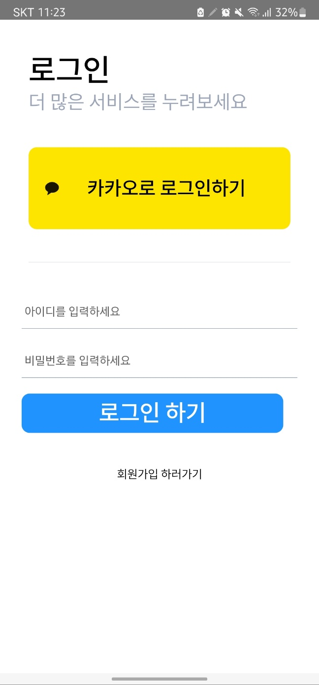
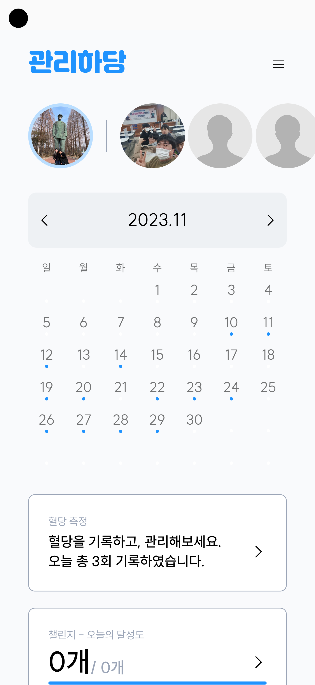
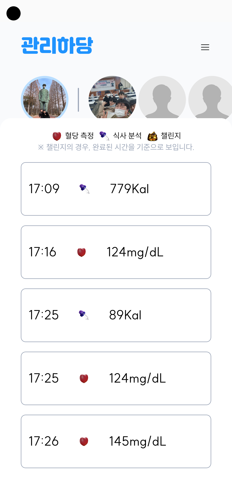
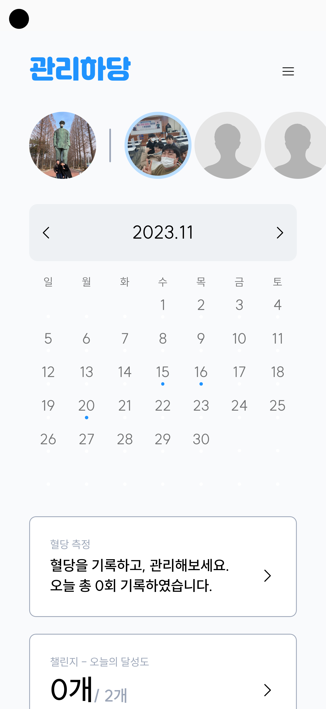
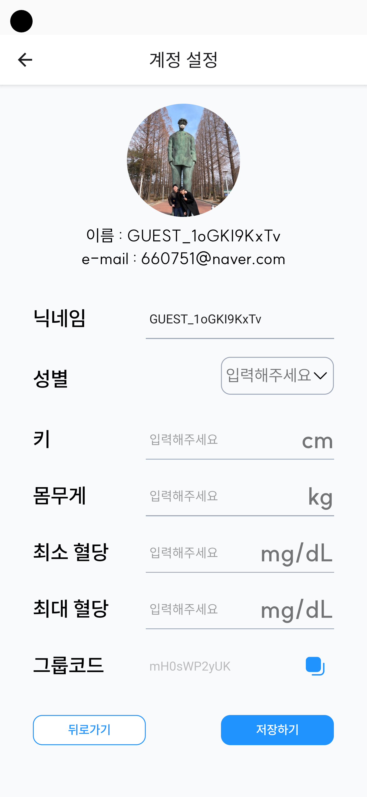

### 혈당 관리

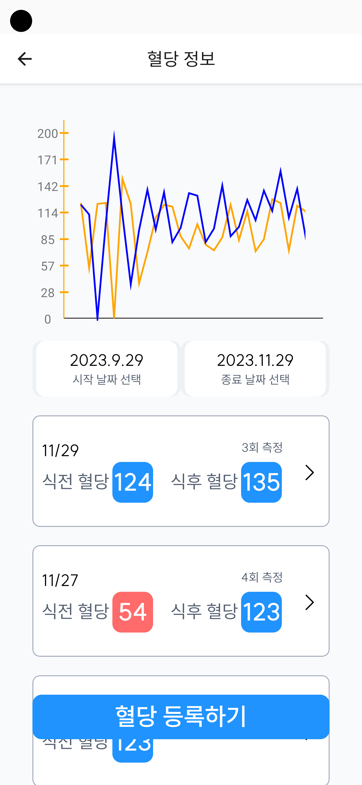
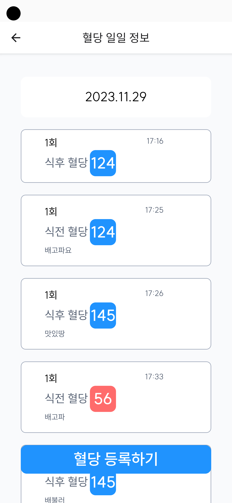
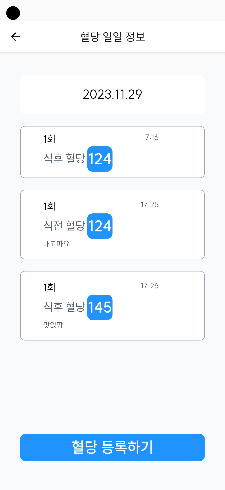
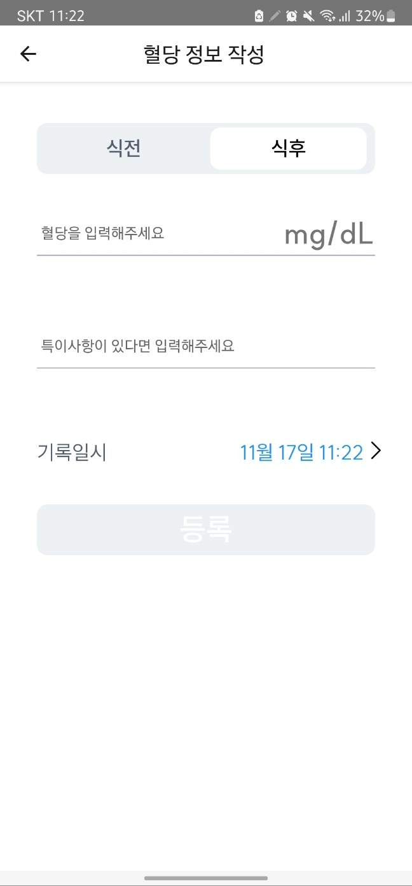

### 식단 관리

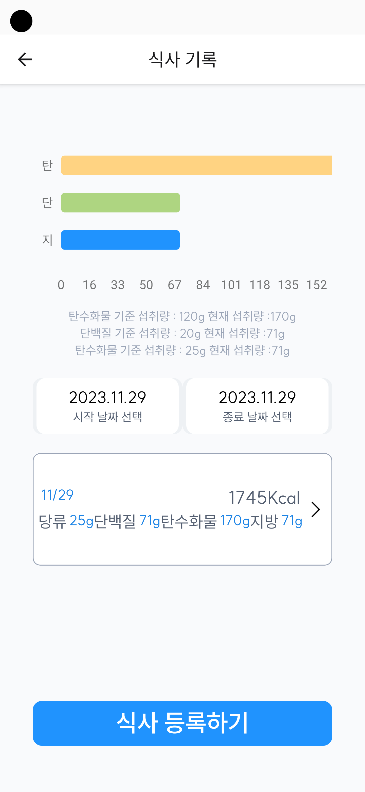
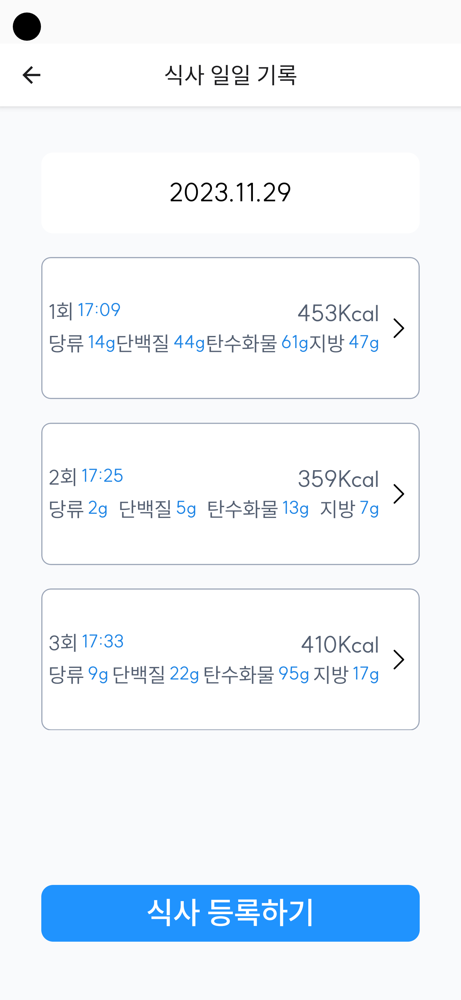
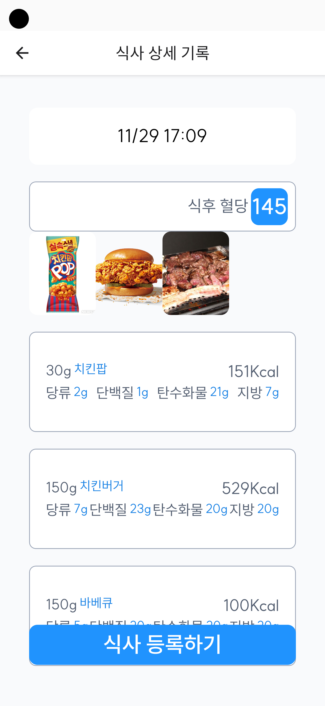
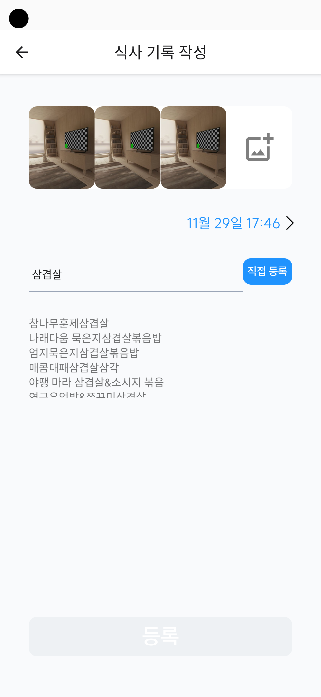
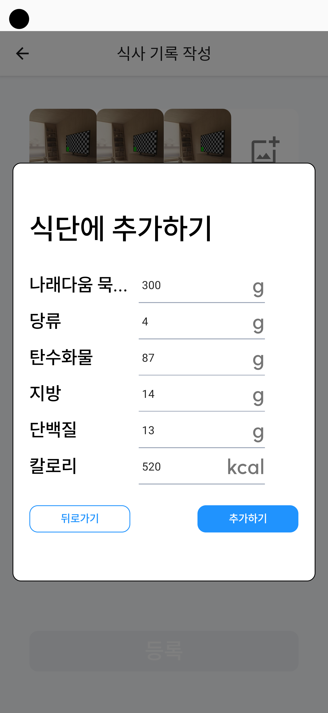

### 챌린지

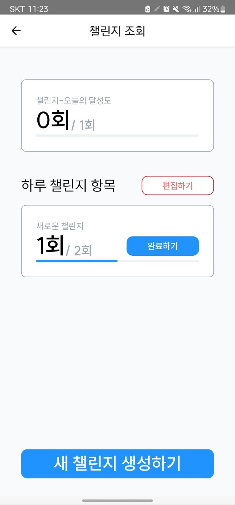
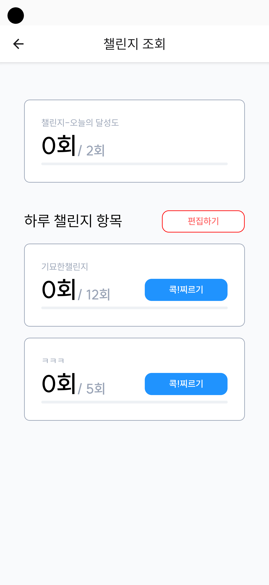

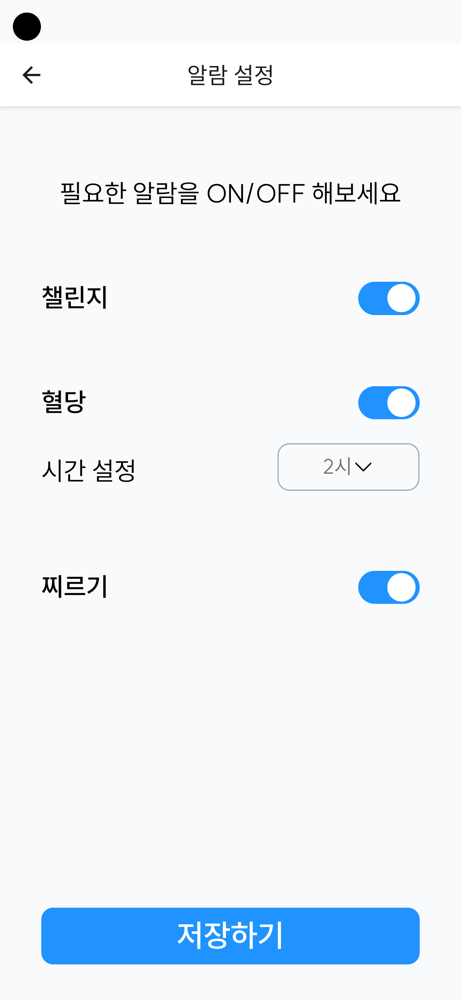

